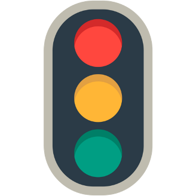
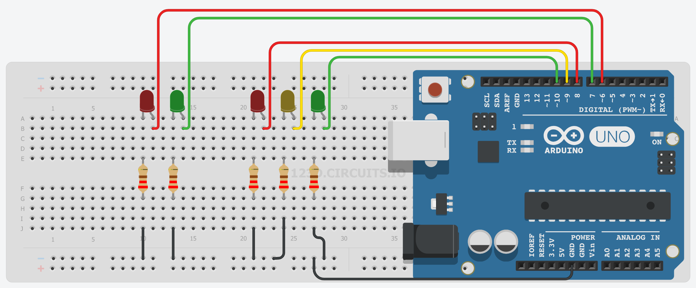
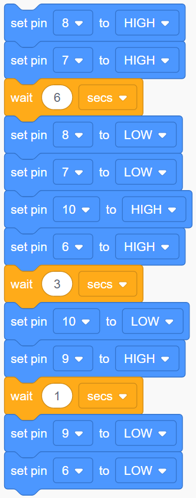

# Proyecto 5: Semáforo para vehículos y peatones

Añadimos ahora dos luces para que pueda regularse, además del tráfico de vehículos, el paso de los peatones.
Si te fijas bien, esto último no es sino lo que hicimos en el montaje número 2, correspondiente a los ledes alternativos. Eso sí, ahora hay que sincronizar con las tres luces del semáforo del ejemplo anterior.

Pretendemos que el ciclo completo del semáforo dure diez segundos, según lo que hicimos en el [ejemplo 4](semáforo_v.md). La **luz verde de los peatones** estará encendida únicamente cuando lo esté la **roja de los vehículos**. En los demás instantes estará encendida la luz roja de los peatones.

- - -
## [Montaje en Tinkercad](https://www.tinkercad.com/things/caUI7bkzz7e)

## Código en TinkerCAD

## Código en ArduinoBlocks

Puedes ver más información y el código completo en [este enlace](http://www.arduinoblocks.com/web/project/10489)

## Mira cómo funciona

